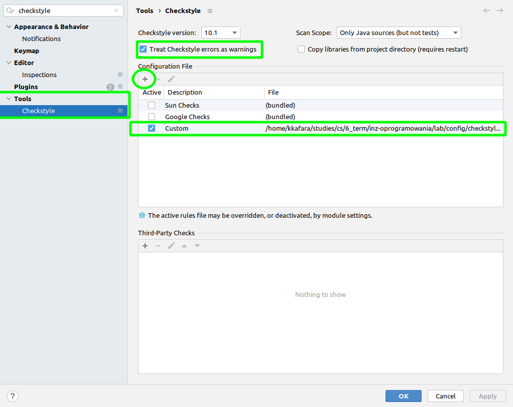

## How to setup checkstyle in IntelliJ

1. Install Checkstyle-IDEA plugin

Go to Settings -> Plugins and look for Checkstyle-IDEA

2. Add our custom configuration file

Go to Settings -> Tools -> Checkstyle and add our configuration file located under `/config/chceckstyle/checkstyle.xml`.

3. Now you can generate report running `./gradlew check` in project root dir 

4. You can auto-fix the code by using `ctrl+alt+L` shortcut (IntelliJ) or by pressing `ctrl+shift+a` and looking for `Reformat code` option.
